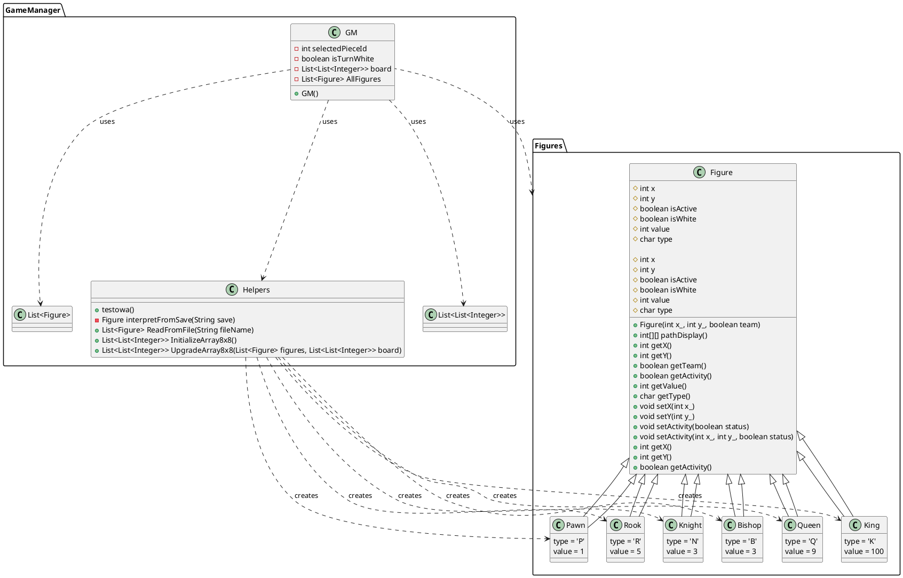

# TESTING BRANCH

Last line of resort before going to main

## UML Diagram

placeholder uml diagram
sadly mermaid is very slow due to using puppeteer x chromium for rendering 💀

```plantuml
@startuml
package Figures {

    abstract class Figure {
        # int x
        # int y
        # boolean isActive
        # boolean isWhite
        # int value
        # char type

        + Figure(int x_, int y_, boolean team)
        + int[][] pathDisplay()
        + int getX()
        + int getY()
        + boolean getTeam()
        + boolean getActivity()
        + int getValue()
        + char getType()
        + void setX(int x_)
        + void setY(int y_)
        + void setActivity(boolean status)
        + void setActivity(int x_, int y_, boolean status)
    }
    Figure <|-- Pawn
    Figure <|-- Rook
    Figure <|-- Knight
    Figure <|-- Bishop
    Figure <|-- Queen
    Figure <|-- King

    Pawn : type = 'P'
    Pawn : value = 1
    Rook : type = 'R'
    Rook : value = 5
    Knight : type = 'N'
    Knight : value = 3
    Bishop : type = 'B'
    Bishop : value = 3
    Queen : type = 'Q'
    Queen : value = 9
    King : type = 'K'
    King : value = 100
}
package Figures {
    class Figure {
        # int x
        # int y
        # boolean isActive
        # boolean isWhite
        # int value
        # char type

        + int getX()
        + int getY()
        + boolean getActivity()
    }

    class Rook
    class Knight
    class Bishop
    class King
    class Queen
    class Pawn

    Figure <|-- Rook
    Figure <|-- Knight
    Figure <|-- Bishop
    Figure <|-- King
    Figure <|-- Queen
    Figure <|-- Pawn
}
package GameManager {

    class GM {
        - int selectedPieceId
        - boolean isTurnWhite
        - List<List<Integer>> board
        - List<Figure> AllFigures

        + GM()
    }

    class Helpers {
        + testowa()
        - Figure interpretFromSave(String save)
        + List<Figure> ReadFromFile(String fileName)
        + List<List<Integer>> InitializeArray8x8()
        + List<List<Integer>> UpgradeArray8x8(List<Figure> figures, List<List<Integer>> board)
    }

    GM ..> Helpers : uses
    GM .l.> Figures : uses
    GM ..> "List<List<Integer>>" : uses
    GM ..> "List<Figure>" : uses
}


Helpers ..> Rook : creates
Helpers ..> Knight : creates
Helpers ..> Bishop : creates
Helpers ..> King : creates
Helpers ..> Queen : creates
Helpers ..> Pawn : creates
@enduml
```
