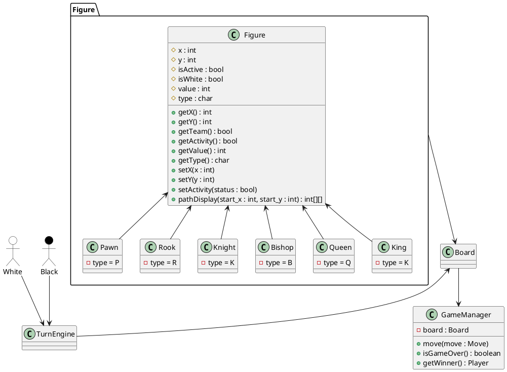

# czeski_szach

Chess human bot vs a computer bot

## UML Diagram

placeholder uml diagram
sadly mermaid is very slow due to using puppeteer x chromium for rendering 💀

```plantuml
@startuml
allowmixing
class Figure.Figure {
    # x : int
    # y : int
    # isActive : bool
    # isWhite : bool
    # value : int
    # type : char

    + getX() : int
    + getY() : int
    + getTeam() : bool
    + getActivity() : bool
    + getValue() : int
    + getType() : char
    + setX(x : int)
    + setY(y : int)
    + setActivity(status : bool)
    + pathDisplay(start_x : int, start_y : int) : int[][]
}
class Figure.Pawn {
    - type = P
}
class Figure.Rook {
    - type = R
}
class Figure.Knight {
    - type = K
}
class Figure.Bishop {
    - type = B
}
class Figure.Queen {
    - type = Q
}
class Figure.King {
    - type = K
}
class GameManager {
    - board : Board
    + move(move : Move)
    + isGameOver() : boolean
    + getWinner() : Player
}

class Board
class TurnEngine

actor White #white
actor Black #black

White --> TurnEngine
Black --> TurnEngine

TurnEngine -u-> Board

Figure --> Board
Board --> GameManager
Figure.Figure <-d- Figure.Pawn
Figure.Figure <-d- Figure.Rook
Figure.Figure <-d- Figure.Knight
Figure.Figure <-d- Figure.Bishop
Figure.Figure <-d- Figure.Queen
Figure.Figure <-d- Figure.King


@enduml
```
