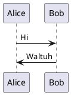
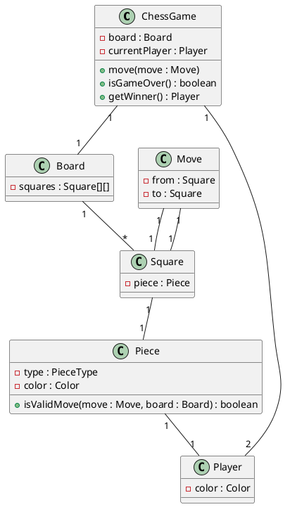

# 必死に勉強しているだけがある場所へようこそ

```plantuml
@startuml
Alice -> Bob: Hi
Bob -> Alice: Waltuh
```

```plantuml
@startuml
class ChessGame {
    - board : Board
    - currentPlayer : Player
    + move(move : Move)
    + isGameOver() : boolean
    + getWinner() : Player
}

class Board {
    - squares : Square[][]
}

class Square {
    - piece : Piece
}

class Piece {
    - type : PieceType
    - color : Color
    + isValidMove(move : Move, board : Board) : boolean
}

class Player {
    - color : Color
}

class Move {
    - from : Square
    - to : Square
}

ChessGame "1" -- "1" Board
ChessGame "1" -- "2" Player
Board "1" -- "*" Square
Square "1" -- "1" Piece
Move "1" -- "1" Square
Move "1" -- "1" Square
Piece "1" -- "1" Player
@enduml
```
